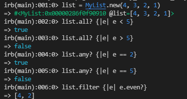

# Enumerable

Create a class `MyList` and a module `MyEnumerable` which will implement a subset of the functionality of [Enumerable](https://ruby-doc.org/core-3.0.0/Enumerable.html).

## Result from running the methods

# Built with

- Ruby

# Installation

Clone the repo and run `bundle install` in the command line to install the dependencies, then run `MyList.rb`

## Authors

👤 **Juliana Ifionu**

- GitHub: [@julie-ify](https://github.com/julie-ify)
- LinkedIn: [Juliana Ifionu](https://linkedin.com/in/e-ifionu)

👤 **Robert Baiesita**

- GitHub: [@ReshyResh](https://github.com/ReshyResh)
- LinkedIn: [Robert Baiesita](https://linkedin.com/in/ReshyResh)

👤 **Daniel M. Matongo**

- GitHub: [@mmatongo](https://github.com/mmatongo)
- LinkedIn: [Daniel M. Matongo](https://linkedin.com/in/mmatongo)

# 🤝 Contributing

Feel free to check the [issues page](https://github.com/julie-ify/my_enumerable_ruby/issues).
